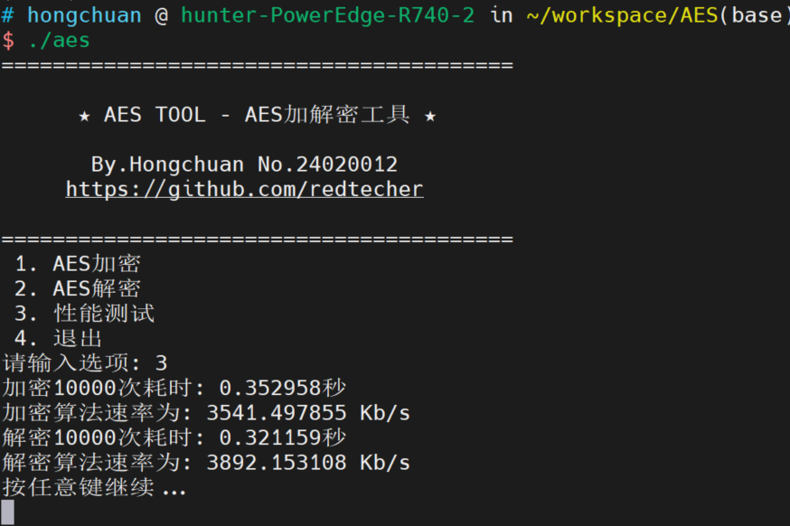
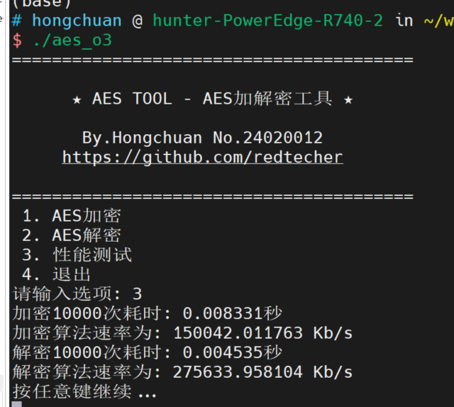

# AES TOOL - AES加解密工具


Redtecher No.24XXXXXX

## 简介

本项目为一个用 C 语言实现的 **AES-128 加解密工具**，支持命令行交互，能够进行 AES 加密、解密以及性能测试。适合学习 AES 算法原理、实验和日常加密解密使用。

---

## 功能

- **AES-128 加密**：输入16字节密钥和明文，输出密文
- **AES-128 解密**：输入16字节密钥和密文，输出明文
- **性能测试**：测试加解密速度
- **交互式菜单**：简单易用的命令行界面

---

## 使用方法

### 1. 编译

```bash
gcc -o aes aes_c.c
or
gcc -O3 -o aes aes_c.c
```

### 2. 运行

```bash
./aes
```

### 3. 菜单说明

程序启动后会显示如下菜单：

```
========================================
                                        
      ★ AES TOOL - AES加解密工具 ★      
                                        
       By.Hongchuan No.24020012         
     https://github.com/redtecher       
                                        
========================================
 1. AES加密
 2. AES解密
 3. 性能测试
 4. 退出
```

根据提示输入选项即可。

---

## 文件目录
```

filetree
├── aes_c.c     # aes算法主要实现目录
├── aes         # gcc -o aes aes_c.c
├── aes_o3      # gcc -O3 -o aes_o3 aes_c.c
├── Readme.md
```


## 示例

### AES加密

- 输入16字节密钥（如：`2b 7e 15 16 28 ae d2 a6 ab f7 15 88 09 cf 4f 3c`）
- 输入16字节明文（如：`32 43 f6 a8 88 5a 30 8d 31 31 98 a2 e0 37 07 34`）
- 输出密文（如：`39 25 84 1d 02 dc 09 fb dc 11 85 97 19 6a 0b 32`）

### AES解密

- 输入16字节密钥
- 输入16字节密文
- 输出明文

---

## 性能测试

选择菜单“3. 性能测试”可查看加解密速度。

### 速度测试结果

#### 普通编译测试速率
加密10000次耗时: 0.352958秒

加密算法速率为: 3541.497855 Kb/s

解密10000次耗时: 0.321159秒

解密算法速率为: 3892.153108 Kb/s




#### O3编译测试速率

加密10000次耗时: 0.008331秒

加密算法速率为: 150042.011763 Kb/s

解密10000次耗时: 0.004535秒

解密算法速率为: 275633.958104 Kb/s




---

## 参考

- [AES算法原理 - 百度百科](https://baike.baidu.com/item/%E9%AB%98%E7%BA%A7%E5%8A%A0%E5%AF%86%E6%A0%87%E5%87%86)

---

## License

MIT

---

> By.Redtecher No.24XXXXXX 
> https://github.com/redtecher
